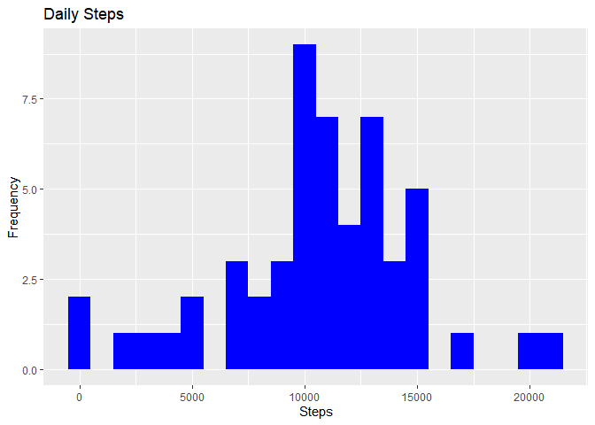
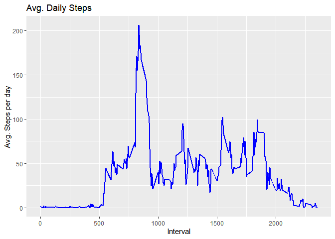
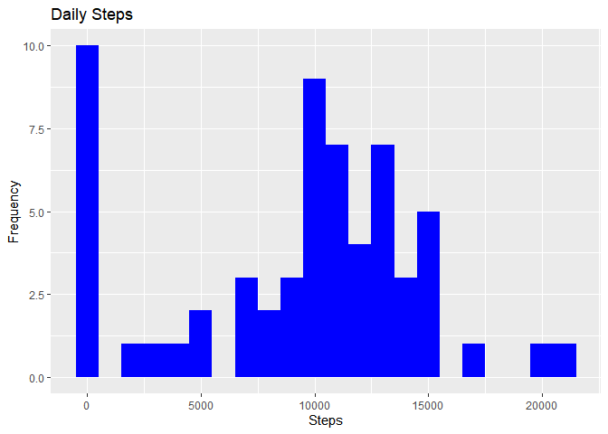
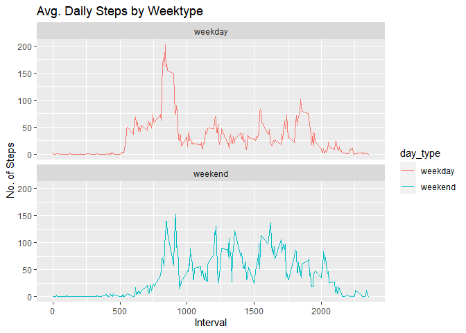

## Loading and preprocessing the data


```r
Sys.setlocale("LC_TIME", "C") # This line is because my language is not english
library(ggplot2)
unzip("activity.zip",exdir = "data")
activity <- read.csv("data/activity.csv")
activity$date <- as.POSIXct(activity$date, format="%Y-%m-%d")
# Create a column for the day of the week
activity$dow <- weekdays(activity$date)
```


## What is mean total number of steps taken per day?

* Calculate number of steps per day


```r
total_steps <- aggregate(activity$steps, list(activity$date), sum)
names(total_steps) <- c("date", "steps")
head(total_steps, 10)
```

```
##          date steps
## 1  2012-10-01    NA
## 2  2012-10-02   126
## 3  2012-10-03 11352
## 4  2012-10-04 12116
## 5  2012-10-05 13294
## 6  2012-10-06 15420
## 7  2012-10-07 11015
## 8  2012-10-08    NA
## 9  2012-10-09 12811
## 10 2012-10-10  9900
```

* Make a histogram of the total number of steps taken each day.


```r
ggplot(total_steps, aes(x = steps)) +
    geom_histogram(fill = "blue", binwidth = 1000) +
    labs(title = "Daily Steps", x = "Steps", y = "Frequency")
```

```
## Warning: Removed 8 rows containing non-finite values (stat_bin).
```

<!-- -->

* Calculate the Median and Mean of the Total Steps per day


```r
print(paste0("Mean  : ", mean(total_steps$steps, na.rm=T)))
```

```
## [1] "Mean  : 10766.1886792453"
```

```r
print(paste0("Median: ", median(total_steps$steps, na.rm=T)))
```

```
## [1] "Median: 10765"
```

## What is the average daily activity pattern?

* Make a time series plot (i.e. 𝚝𝚢𝚙𝚎 = "𝚕") of the 5-minute interval (x-axis) and the average number of steps taken, averaged across all days (y-axis)


```r
intervaldf <- aggregate(activity$steps, list(activity$interval), mean, na.rm=T)
names(intervaldf) <- c("interval", "steps_mean")
ggplot(intervaldf, aes(x = interval , y = steps_mean)) + geom_line(color="blue", size=1) + labs(title = "Avg. Daily Steps", x = "Interval", y = "Avg. Steps per day")
```

<!-- -->

* Which 5-minute interval, on average across all the days in the dataset, contains the maximum number of steps?


```r
print(paste0("Interval with Maximum number of steps: ", intervaldf$interval[intervaldf$steps_mean == max(intervaldf$steps_mean)]))
```

```
## [1] "Interval with Maximum number of steps: 835"
```

## Imputing missing values

* Calculate and report the total number of missing values in the dataset (i.e. the total number of rows with 𝙽𝙰s)


```r
nrow(activity[is.na(activity$steps),])
```

```
## [1] 2304
```

* Devise a strategy for filling in all of the missing values in the dataset. The strategy does not need to be sophisticated. For example, you could use the mean/median for that day, or the mean for that 5-minute interval, etc


```r
# Filling missing values with median

activity_noNA <- data.frame(activity)

activity_noNA$steps[is.na(activity_noNA$steps)] <- median(activity_noNA$steps, na.rm=TRUE)

# show the number of NA rows
nrow(activity_noNA[is.na(activity_noNA$steps),])
```

```
## [1] 0
```

```r
# Save the new dataset
write.csv(activity_noNA, "data\\tidydata.csv", row.names = FALSE)
```

* Make a histogram of the total number of steps taken each day and calculate and report the mean and median total number of steps taken per day. Do these values differ from the estimates from the first part of the assignment? What is the impact of imputing missing data on the estimates of the total daily number of steps?


```r
total_steps_noNA <- aggregate(activity_noNA$steps, list(activity_noNA$date), sum)
names(total_steps_noNA) <- c("date", "steps")
head(total_steps_noNA, 10)
```

```
##          date steps
## 1  2012-10-01     0
## 2  2012-10-02   126
## 3  2012-10-03 11352
## 4  2012-10-04 12116
## 5  2012-10-05 13294
## 6  2012-10-06 15420
## 7  2012-10-07 11015
## 8  2012-10-08     0
## 9  2012-10-09 12811
## 10 2012-10-10  9900
```


```r
ggplot(total_steps_noNA, aes(x = steps)) +
    geom_histogram(fill = "blue", binwidth = 1000) +
    labs(title = "Daily Steps", x = "Steps", y = "Frequency")
```

<!-- -->


```r
print(paste0("Mean  : ", mean(total_steps_noNA$steps)))
```

```
## [1] "Mean  : 9354.22950819672"
```

```r
print(paste0("Median: ", median(total_steps_noNA$steps)))
```

```
## [1] "Median: 10395"
```

The value of the Mean lowered a bit but the Median lowered a lot more.

## Are there differences in activity patterns between weekdays and weekends?

* Create a new factor variable with two levels: weekday or weekend


```r
activity_noNA[grepl(pattern="Monday|Tuesday|Wednesday|Thursday|Friday", x=activity_noNA$dow), "day_type"] <- "weekday"
activity_noNA[grepl(pattern="Saturday|Sunday", x=activity_noNA$dow), "day_type"] <- "weekend"
activity_noNA$day_type <- as.factor(activity_noNA$day_type)
```

* Make a panel plot containing a time series plot (i.e. 𝚝𝚢𝚙𝚎 = "𝚕") of the 5-minute interval (x-axis) and the average number of steps taken, averaged across all weekday days or weekend days (y-axis).


```r
intervaldf2 <- aggregate(steps~interval+day_type, activity_noNA, mean)
ggplot(intervaldf2 , aes(x = interval , y = steps, color=`day_type`)) + geom_line() + labs(title = "Avg. Daily Steps by Weektype", x = "Interval", y = "No. of Steps") + facet_wrap(~`day_type` , ncol = 1, nrow=2)
```

<!-- -->

